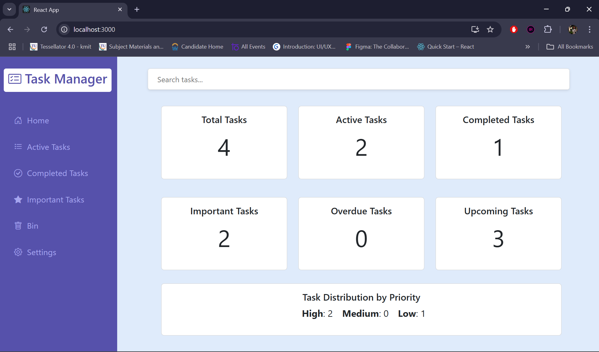
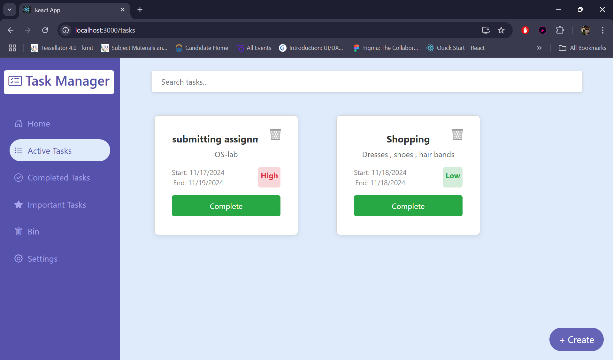
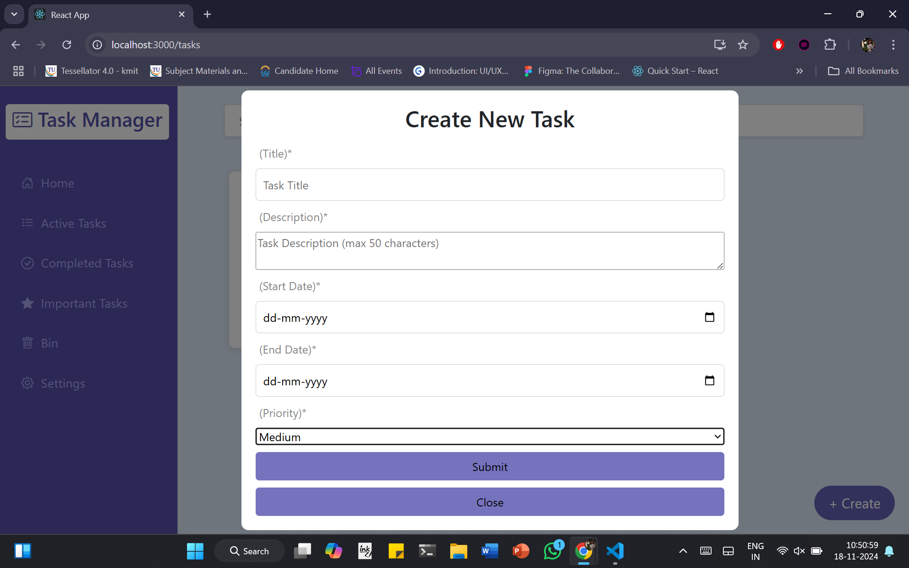
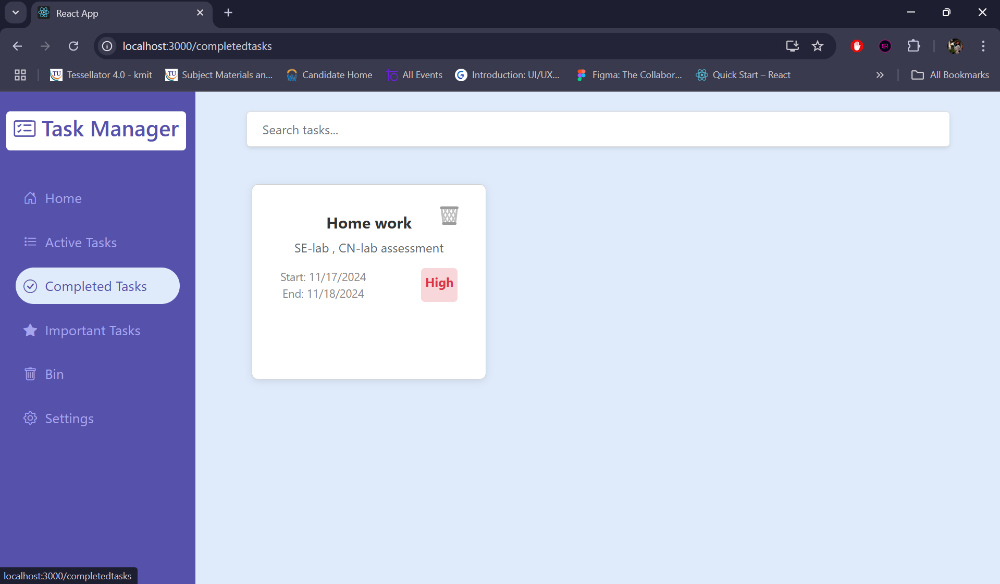
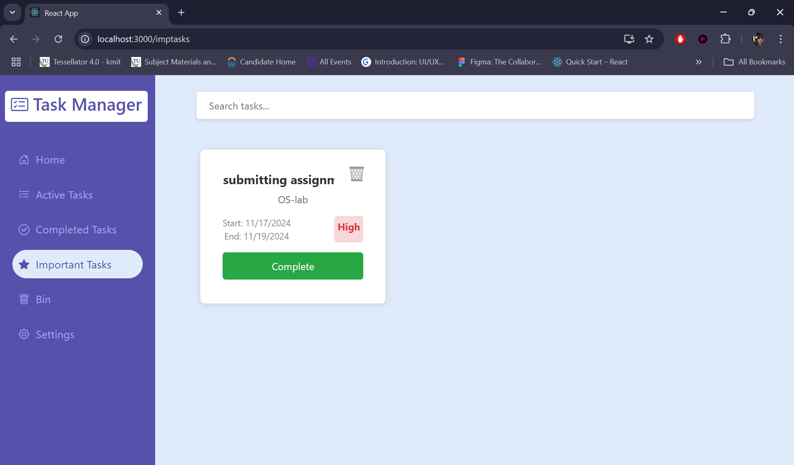
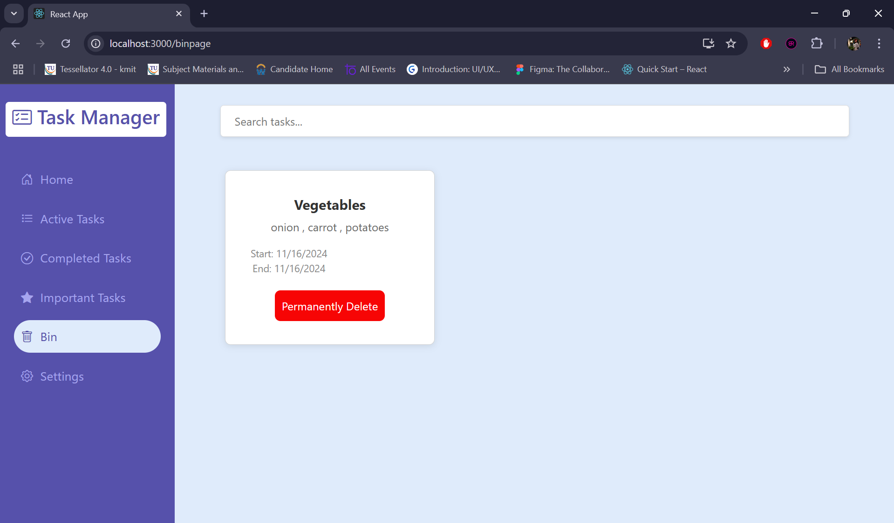

# Task Management Application (MERN Stack)
## Overview

This is a **task management application** built using the **MERN Stack** (MongoDB, Express, React, Node.js). The app allows users to create, track, and manage tasks. Tasks can be categorized by priority (High, Medium, Low) and status (Active, Completed, Deleted). The app also provides insights into task statistics, such as total tasks, upcoming tasks, completed tasks, and priority distribution.

### Key Features:
- **Dashboard**: Displays task statistics, including total tasks, active tasks, completed tasks, important tasks, overdue tasks, and upcoming tasks.
- **Task Management**: Allows users to add tasks, mark them as completed, and delete them.
- **Priority Distribution**: Shows how tasks are distributed across different priorities (High, Medium, Low).
- **Search Bar**: A search bar that helps users filter tasks by keywords.
- **Responsive Design**: The app is fully responsive, providing a smooth experience on both mobile and desktop devices.

### Technologies Used:
- **MongoDB**: NoSQL database for storing task data.
- **Express.js**: Web framework for Node.js for handling routing and API requests.
- **React.js**: Frontend JavaScript library for building the user interface.
- **Node.js**: JavaScript runtime for running the backend server.
- **Axios**: HTTP client for making requests to the backend API.
- **React-Bootstrap**: For building responsive and styled UI components.
- **Mongoose**: ODM for MongoDB for data modeling and database operations.

## Setup and Launch Process

- Follow the steps below to set up the project locally:

### 1. Clone the Repository
- First, clone the repository to your local machine:

### bash
- git clone https://github.com/SaiSrihitha-Mallela/FLARELINK-ASSIGNMENT-.git
- cd FLARELINK-ASSIGNMENT-

### Setup Backend (Node.js & Express)
- **Install Backend Dependencies**
- Navigate to the backend folder and install the necessary dependencies:
- cd backend
- npm init -y (for package.json)
- npm install node-modules
- npm install axios cors nodemon mongoose 
- npm start 

### Configure Environment Variables
- Create a .env file in the backend folder and add the following environment variables:
- M-ONGO_URI = your-mongodb-uri
- PORT=5000

### Run the Backend Server
- **Start the backend server** : npm start

- Setup Frontend (React.js)
- cd frontend
- Install Frontend Dependencies : npx create-react-app frontend
- npm i axios react-router-dom react-bootstrap 
- npm start

## Components and Functionality

### Frontend Components

- **Sidebar**: A fixed sidebar that provides quick access to sections like Dashboard, Important Tasks, Completed Tasks, and Deleted Tasks.
- **Search Bar**: A search bar to filter tasks based on keywords.
- **Home Page (Dashboard)**: Displays statistics about tasks, including:
  - Total tasks
  - Active tasks
  - Completed tasks
  - Important tasks
  - Overdue tasks
  - Upcoming tasks
  - Priority distribution (High, Medium, Low)
- **Task Management**: Users can view, add, mark tasks as completed and delete tasks.
- **New Task Form**: User can create a new task by filling the new task from , which contains tile , description, start data , end data and setting priority feilds.
- **Completed Tasks Page**: Displays all tasks that have been completed.
- **Important Tasks Page**: Displays tasks marked as high priority.
- **Deleted Tasks Page (Bin)**: Displays tasks that have been marked for deletion but are not yet permanently deleted. Users can permanently delete tasks from here.

### Backend Routes and APIs

- **GET /api/dashboard**: Fetches task statistics (total, active, completed, overdue, etc.).
- **GET /api/tasks**: Fetches all tasks.
- **GET /api/tasks/completed**: Fetches completed tasks.
- **GET /api/tasks/important**: Fetches important tasks (priority: High).
- **GET /api/tasks/deleted**: Fetches deleted tasks.
- **PATCH /api/tasks/:id/complete**: Marks a task as completed.
- **PATCH /api/tasks/:id/delete**: Marks a task as deleted.
- **DELETE /api/tasks/:id**: Permanently deletes a task.

## Assumptions Made During Development

- MongoDB is set up and running, and the connection URI is provided in the `.env` file.
- Basic understanding of the MERN stack is expected.
- API routes are assumed to be functional as per the backend setup.
- The application assumes the data structure for tasks includes fields like title, description, startDate, endDate, priority, and isCompleted.
- CORS (Cross-Origin Resource Sharing) is handled on the backend for API requests from the frontend.
## Screenshots

### 1. Dashboard (Home Page)

### 2. Active Tasks Page

### 3 . Create New Task

### 4. Completed Tasks Page

### 5. Important Tasks Page

### 6. Deleted Tasks (Bin) Page

---
Happy Task mamanagement!!!
